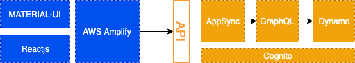

## AWS Serverless Online School Enrolment

Online School Enrolment App is a web application portal that allows Parents to select available grade levels and enrol their child or children online. This project is inspired by the [AWS Serverless Airline Booking](https://github.com/aws-samples/aws-serverless-airline-booking).

### Online School Enrolment - High Level Architecture

### Task List

- [x] High Level Diagram
- [x] Use Cases
- [] UI/UX (mockup)
- [] Build the frontend w/ React and Material UI using canned data
- [] Batabase Design
- [] Build the backend w/ Amplify and AppSync
- [] Integration
- [] End to End testing

### Parent Use Cases (for version 1)

- [] Anyone can view the Grade Levels and Schedules List
- [] A Parent can create an Account
- [] A Parent can log in/out to/from his/her account
- [] A Parent can enroll a child to any open Grade Level

### Admin Use Cases (for version 1)

- [] An Admin can view enrolment submissions
- [] An Admin can accept or decline an enrolment submission

## License Summary

This sample code is made available under the MIT-0 license. See the LICENSE file.
